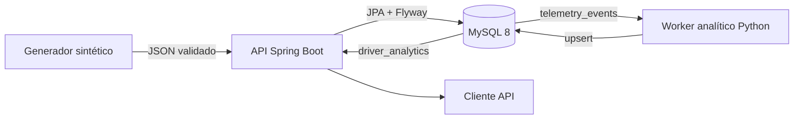

<div align="center">

# FleetSignal

**Telemetría sintética de entrada. Analítica reproducible de salida.**

[](https://github.com/DevPooks/fleetsignal/actions/workflows/ci.yml)
[](backend/pom.xml)
[](analytics/requirements.txt)
[](LICENSE)

[English](README.md) · [Español](README.es.md)

</div>

FleetSignal es una plataforma pequeña de telemática que funciona completamente en local. Una API con Spring Boot valida y guarda eventos sintéticos de vehículos en MySQL; un pipeline en Python transforma esos eventos en métricas deterministas por conductor y para la flota. El repositorio es lo bastante compacto para seguir una petición desde la validación HTTP hasta SQL y el resultado analítico.

> **Alcance:** FleetSignal usa datos inventados y un puntaje demostrativo. No es un sistema de seguros, seguridad vial, análisis actuarial ni evaluación de riesgo para producción.

## Por qué construí este proyecto

Lo interesante de la telemática no es generar una velocidad aleatoria, sino conservar el significado del dato entre componentes: rechazar mediciones imposibles, mantener las relaciones entre conductores y vehículos, agregar registros siempre de la misma forma y demostrar el comportamiento con pruebas. FleetSignal se concentra en esos fundamentos de backend y data engineering.

## Arquitectura



Flyway es el dueño del esquema. El worker lee la telemetría en un orden determinista y actualiza una fila de métricas por conductor.

## Funcionalidad

- Alta y consulta de conductores y vehículos sintéticos.
- Ingesta con referencias existentes y rangos de medición validados.
- Paginación y filtros temporales por conductor o vehículo.
- Velocidad promedio/máxima, contadores, distancia estimada y puntaje demostrativo.
- Métricas por conductor, resumen de flota, salud de la base de datos y OpenAPI interactivo.
- Pruebas Java, integración con MySQL/Testcontainers, cálculos Python y regresión de velocidad negativa.

## Inicio rápido

Necesitas Docker con Compose v2, Python 3.12+ para cargar datos y los puertos `8080`/`3306` disponibles.

```bash
git clone https://github.com/DevPooks/fleetsignal.git
cd fleetsignal
cp .env.example .env
docker compose up --build -d
curl http://localhost:8080/health
```

La documentación interactiva queda en [http://localhost:8080/docs](http://localhost:8080/docs).

```bash
python scripts/generate_events.py --drivers 5 --events 500 --seed 42
docker compose --profile tools run --rm analytics
curl http://localhost:8080/api/v1/fleet/summary
```

## API

| Método | Ruta | Uso |
|---|---|---|
| `POST` | `/api/v1/drivers` | Crear conductor |
| `GET` | `/api/v1/drivers/{id}` | Consultar conductor |
| `POST` | `/api/v1/vehicles` | Crear vehículo |
| `GET` | `/api/v1/vehicles/{id}` | Consultar vehículo |
| `POST` | `/api/v1/events` | Ingresar evento |
| `GET` | `/api/v1/events/{id}` | Consultar evento |
| `GET` | `/api/v1/drivers/{id}/events` | Paginar por conductor |
| `GET` | `/api/v1/vehicles/{id}/events` | Paginar por vehículo |
| `GET` | `/api/v1/drivers/{id}/analytics` | Consultar analítica calculada |
| `GET` | `/api/v1/fleet/summary` | Resumir la flota |
| `GET` | `/health` | Revisar API y MySQL |

## Cómo se calcula la analítica

La definición de exceso de velocidad es configurable mediante `SPEEDING_THRESHOLD_KMH` (100 km/h por defecto). La distancia estimada es la diferencia entre el odómetro máximo y mínimo. El puntaje usa:

```text
min(100, excesos × 2 + frenadas bruscas × 3 + aceleraciones rápidas × 2)
```

Este puntaje es una métrica determinista diseñada únicamente para este proyecto de portafolio. No está pensado para seguros, evaluación de seguridad de conductores, análisis actuarial ni decisiones reales.

## Pruebas

```bash
make test-java
make test-python
make build
make format
```

La suite Java incluye una ruta rápida con H2 y una prueba de migración sobre MySQL 8 con Testcontainers. Si Docker no está disponible, solo esa prueba se omite. Consulta la [estrategia de pruebas](docs/testing.md) y el [caso de regresión](docs/regression-example.md).

## Decisiones de seguridad

- Flyway crea el esquema y Hibernate lo valida.
- MySQL usa `DECIMAL`; Java usa `BigDecimal` para mediciones persistidas.
- Las consultas usan parámetros y las credenciales provienen del entorno.
- `.env` está ignorado; el repositorio solo incluye valores locales de ejemplo.
- Los errores externos no exponen detalles de base de datos ni credenciales.
- Esta versión no tiene autenticación; no debe exponerse a una red no confiable.

## Límites conocidos

- La ingesta procesa un evento por petición y no usa una cola.
- El worker se ejecuta manualmente; no es un pipeline en streaming.
- La distancia supone un odómetro no decreciente.
- No hay autenticación, autorización, multi-tenancy ni rate limiting.
- Las coordenadas se validan y guardan, pero no se infieren rutas ni límites geográficos.

## Más documentación

- [Arquitectura](docs/architecture.md)
- [Modelo de datos](docs/database.md)
- [Pruebas](docs/testing.md)
- [Política de seguridad](SECURITY.md)
- [Notas para entrevistas](docs/interview-notes.md)
- [Resumen para CV](docs/cv-summary.md)

## Licencia

MIT © 2026 DevPooks
