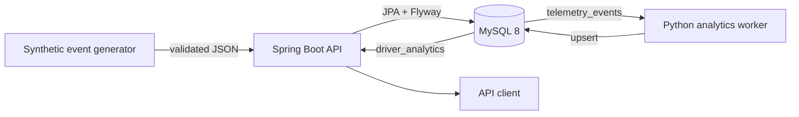

<div align="center">

# FleetSignal

**Synthetic telematics in. Reproducible fleet analytics out.**

[](https://github.com/DevPooks/fleetsignal/actions/workflows/ci.yml)
[](backend/pom.xml)
[](analytics/requirements.txt)
[](LICENSE)

[English](README.md) · [Español](README.es.md)

</div>

FleetSignal is a small, local-first telematics platform. A Spring Boot API validates and stores synthetic vehicle events in MySQL; a Python pipeline turns those events into deterministic driver and fleet summaries. The repository is intentionally compact enough to trace a request from HTTP validation through SQL persistence and into a repeatable analytics result.

> **Scope matters:** FleetSignal uses fabricated data and a demonstration score. It is not an insurance, safety, actuarial, or production risk system.

## Why I built this

The interesting part of telemetry is not producing a random speed value. It is preserving the meaning of that value across service boundaries: rejecting impossible measurements, maintaining driver/vehicle relationships, aggregating records consistently, and proving the behavior with tests. FleetSignal is a focused exercise in those backend and data-engineering fundamentals.

## Architecture



The API and analytics worker share a schema, not an in-process model. Flyway owns that schema. The worker reads telemetry in a deterministic order and upserts one current analytics row per driver.

## What it does

- Creates and retrieves synthetic drivers and vehicles.
- Accepts telemetry only when references exist and measurements are within documented ranges.
- Pages and time-filters events by driver or vehicle.
- Calculates average/max speed, event counts, estimated distance, and a capped demo score.
- Exposes driver analytics, a fleet summary, health status, and interactive OpenAPI docs.
- Keeps Java integration tests, MySQL/Testcontainers coverage, Python calculation tests, and a regression test for negative speed.
- Runs locally with Docker Compose; no paid service or external data feed is required.

## Quick start

Requirements: Docker with Compose v2, Python 3.12+ for the seed script, and ports `8080`/`3306` available.

```bash
git clone https://github.com/DevPooks/fleetsignal.git
cd fleetsignal
cp .env.example .env
docker compose up --build -d
curl http://localhost:8080/health
```

Expected health response:

```json
{"status":"UP","database":"UP"}
```

Swagger UI is available at [http://localhost:8080/docs](http://localhost:8080/docs). The raw OpenAPI document is at `/v3/api-docs`.

### Load a reproducible demo dataset

```bash
python scripts/generate_events.py --drivers 5 --events 500 --seed 42
docker compose --profile tools run --rm analytics
curl http://localhost:8080/api/v1/fleet/summary
```

The generator uses neutral demo identifiers such as `demo-driver-...`; it contains no real person or location data.

## API at a glance

| Method | Route | Purpose |
|---|---|---|
| `POST` | `/api/v1/drivers` | Create a driver |
| `GET` | `/api/v1/drivers/{id}` | Retrieve a driver |
| `POST` | `/api/v1/vehicles` | Create a vehicle |
| `GET` | `/api/v1/vehicles/{id}` | Retrieve a vehicle |
| `POST` | `/api/v1/events` | Ingest one telemetry event |
| `GET` | `/api/v1/events/{id}` | Retrieve one event |
| `GET` | `/api/v1/drivers/{id}/events` | Page driver events |
| `GET` | `/api/v1/vehicles/{id}/events` | Page vehicle events |
| `GET` | `/api/v1/drivers/{id}/analytics` | Retrieve calculated metrics |
| `GET` | `/api/v1/fleet/summary` | Summarize stored fleet data |
| `GET` | `/health` | Check API/database health |

Create an event:

```bash
curl -X POST http://localhost:8080/api/v1/events \
  -H 'Content-Type: application/json' \
  -d '{
    "driverId": 1,
    "vehicleId": 1,
    "eventTimestamp": "2026-01-01T12:00:00Z",
    "speedKmh": 84.50,
    "hardBraking": false,
    "rapidAcceleration": true,
    "odometerKm": 18234.75,
    "latitude": -0.125,
    "longitude": 0.210
  }'
```

Validation errors have one stable envelope and include the request ID:

```json
{
  "error": {
    "code": "INVALID_REQUEST",
    "message": "Request validation failed.",
    "details": {"speedKmh": "must be greater than or equal to 0.0"},
    "requestId": "d435e73b-...",
    "timestamp": "2026-01-01T12:00:00Z"
  }
}
```

## Analytics pipeline

For each driver, the worker computes:

| Metric | Definition |
|---|---|
| Average / maximum speed | Aggregate of valid stored events |
| Speeding events | Speed above `SPEEDING_THRESHOLD_KMH` (default `100`) |
| Estimated distance | Highest odometer minus lowest odometer in the processed set |
| Behavior counts | Sum of hard-braking and rapid-acceleration flags |
| Risk score | `min(100, speeding × 2 + hard braking × 3 + rapid acceleration × 2)` |

This score is a deterministic demonstration metric designed only for this portfolio project. It is not intended for insurance underwriting, driver safety assessment, actuarial analysis, or real-world decision making.

Run all drivers with `make analytics`, or target one driver from the analytics container:

```bash
docker compose --profile tools run --rm analytics --driver-id 1
```

## Development and testing

Local toolchain commands:

```bash
make test-java       # JUnit, Spring integration tests, Testcontainers when Docker is available
make test-python     # deterministic Pandas aggregation tests
make build           # backend JAR
make format          # Eclipse Java formatter through Spotless
```

The Java suite has a fast H2 API path and a MySQL 8 Testcontainers migration test. `disabledWithoutDocker` skips only the container-backed test on machines without a Docker daemon. CI runners execute the full build and validate both Dockerfiles.

See [testing strategy](docs/testing.md) and the [negative-speed regression](docs/regression-example.md).

## Design and security notes

- Hibernate validates the schema; Flyway creates it. Production schema generation is never delegated to `ddl-auto`.
- Numeric measurements use `DECIMAL` in MySQL and `BigDecimal` in Java.
- Repository methods and SQLAlchemy use parameter binding; raw request values are not concatenated into SQL.
- Credentials come from environment variables. `.env` is ignored and only safe local examples are committed.
- Request bodies are bounded, exceptions are translated to stable messages, and logs do not contain database credentials.
- This demo deliberately has no authentication. Do not expose it to an untrusted network as-is.

## Repository map

```text
backend/      Spring Boot API, Flyway migration, JUnit/Testcontainers tests
analytics/    Pandas/SQLAlchemy worker and Pytest suite
scripts/      Deterministic synthetic event generator
database/     Schema entry point for database-oriented readers
docs/         Architecture, schema, testing, interview, and CV notes
```

## Known limitations

- Ingestion is one event per request; there is no batch endpoint or queue.
- Analytics is a manually triggered snapshot, not a scheduler or streaming job.
- Estimated distance assumes non-decreasing odometer readings within the selected data.
- The API has no authentication, authorization, tenant boundary, or rate limiting.
- GPS coordinates are stored and validated but no route or speed-limit inference is attempted.

Those constraints are intentional. They keep the data path inspectable and leave clear next steps: authenticated fleet boundaries, batch ingestion, incremental analytics, and observability metrics.

## Documentation

- [Architecture and data flow](docs/architecture.md)
- [Database model](docs/database.md)
- [Testing strategy](docs/testing.md)
- [Security policy](SECURITY.md)
- [Interview notes](docs/interview-notes.md)
- [CV summary](docs/cv-summary.md)

## License

MIT © 2026 DevPooks
