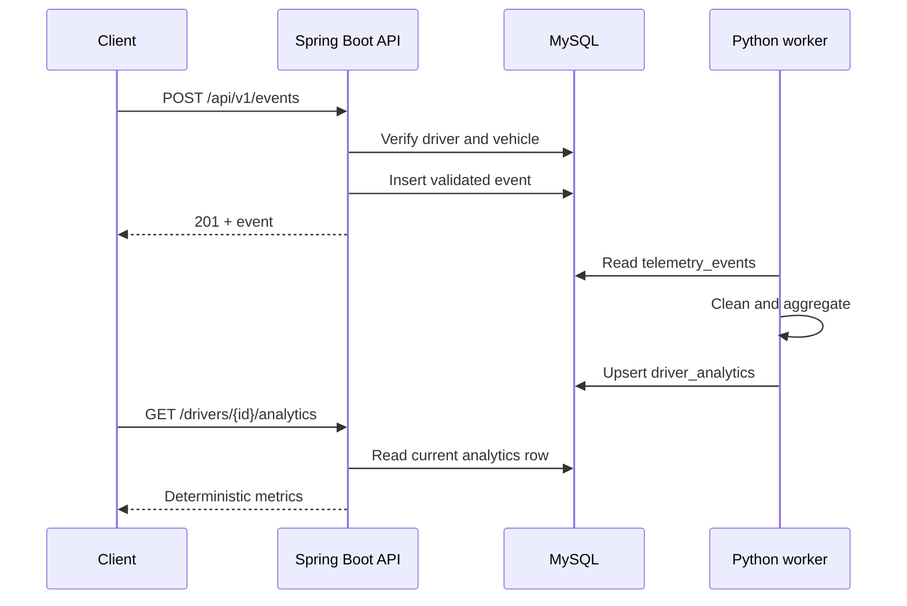

# Architecture

FleetSignal has two application processes and one database. The split is based on workload, not an attempt to create microservices: Java owns synchronous HTTP behavior and domain validation; Python owns tabular aggregation. Both are intentionally deployable together through one Compose file.

## Request and data flow

## Why these components

**Spring Boot** provides a mature HTTP/validation/persistence stack without requiring custom framework code. Constructor injection makes the controller → service → repository path explicit and testable. Controllers translate HTTP, services own transactions and decisions, and Spring Data repositories isolate persistence queries.

**MySQL 8** fits the relational shape of the data. Foreign keys prevent orphaned events, composite indexes serve time-ordered queries by driver or vehicle, and `DECIMAL` preserves the intended measurement precision. Flyway, rather than Hibernate, owns schema evolution.

**Python and Pandas** keep the aggregation readable. The worker performs a bounded batch calculation, so a dataframe is a sensible tool; a scheduler or distributed processing framework would add operational cost without improving this demo.

## Validation boundaries

The API validates request shape and measurement ranges before persistence. The database repeats critical constraints so another writer cannot bypass them accidentally. The worker treats stored data defensively: malformed numeric rows and impossible speeds are excluded before aggregation. This second check is not a replacement for ingestion validation; it prevents one bad historical row from breaking the entire batch.

## Consistency and failure behavior

Each event insert runs in one database transaction. Analytics rows are upserted together in a worker transaction. A failed analytics run leaves the previous snapshot intact, logs the failure, and returns a non-zero process code.

There is no promise of real-time analytics. The API returns `ANALYTICS_NOT_READY` until the worker has processed a driver. That is more honest than returning a zero-filled record that looks calculated.

## Deliberate tradeoffs

- Manual batch execution keeps the data path easy to inspect, at the cost of stale analytics.
- One event per HTTP request keeps validation and error handling clear, at the cost of ingestion throughput.
- No authentication keeps local setup focused, but means the service is not safe for public exposure.
- A single current analytics row simplifies reads; keeping historical snapshots would require a separate history table.
