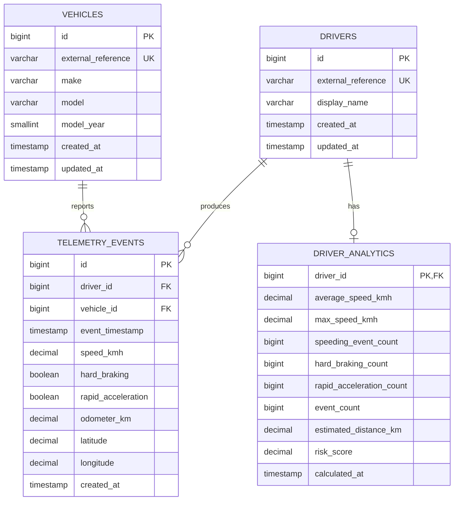

# Database model

Flyway applies the canonical migration at `backend/src/main/resources/db/migration/V1__create_schema.sql`. Hibernate runs with `ddl-auto=validate`, so entity drift stops startup instead of silently changing a production schema.

## Constraints that carry meaning

- Driver and vehicle external references are unique stable demo identifiers.
- An event cannot exist without both a driver and a vehicle.
- Speed, odometer, latitude, and longitude ranges are checked at both API and database boundaries.
- `driver_analytics.driver_id` is simultaneously a primary key and foreign key. This models one current snapshot per driver.
- Deleting a driver cascades only its analytics row. Event history remains protected by the foreign key.

## Indexes

`(driver_id, event_timestamp)` and `(vehicle_id, event_timestamp)` match the two paginated history endpoints. The leading relationship key filters the result set; timestamp ordering keeps the most recent records cheap to retrieve. A separate timestamp index leaves room for fleet-wide time-window queries.

## Precision

Coordinates use `DECIMAL(9,6)`, speed uses `DECIMAL(6,2)`, and odometer/distance use `DECIMAL(12,2)`. Java maps those values to `BigDecimal`. The analytics dataframe uses numeric values during calculation and rounds at the output boundary before MySQL persists them.
